# petit guide de NetPractice 

## sommaire

<!-- no toc -->
  - [rappels sur le binaire](#rappels-sur-le-binaire)
  - [la base sur les réseaux](#la-base-sur-les-réseaux)
  - [division d'un octet par plages selon le masque](#division-dun-octet-par-plages-selon-le-masque)
  - [niveau 1](#niveau-1)
  - [niveau 2](#niveau-2)
  - [niveau 3](#niveau-3)
  - [niveau 4](#niveau-4)
  - [niveau 5](#niveau-5)
  - [niveau 6](#niveau-6)
  - [niveau 7](#niveau-7)
  - [niveau 8](#niveau-8)
  - [niveau 9](#niveau-9)
  - [niveau 10](#niveau-10)

## rappels sur le binaire

tous les nombres décimaux (= écrits en base 10) peuvent s'écrire en binaire (= base 2).

un nombre binaire est composé de bits.  
1 bit = `0` ou `1`

<details open>
<summary>tableau de conversion basique</summary>
<table style="font-family: monospace;">
  <thead>
    <tr>
      <th>Décimal</th>
      <th>Binaire</th>
    </tr>
  </thead>
  <tbody>
    <tr><td>0</td><td><code>00000000</code></td></tr>
    <tr><td>1</td><td><code>00000001</code></td></tr>
    <tr><td>2</td><td><code>00000010</code></td></tr>
    <tr><td>3</td><td><code>00000011</code></td></tr>
    <tr><td>4</td><td><code>00000100</code></td></tr>
    <tr><td>5</td><td><code>00000101</code></td></tr>
    <tr><td>6</td><td><code>00000110</code></td></tr>
    <tr><td>7</td><td><code>00000111</code></td></tr>
    <tr><td>8</td><td><code>00001000</code></td></tr>
    <tr><td>9</td><td><code>00001001</code></td></tr>
    <tr><td>10</td><td><code>00001010</code></td></tr>
    <tr><td>11</td><td><code>00001011</code></td></tr>
    <tr><td>12</td><td><code>00001100</code></td></tr>
    <tr><td>13</td><td><code>00001101</code></td></tr>
    <tr><td>14</td><td><code>00001110</code></td></tr>
    <tr><td>15</td><td><code>00001111</code></td></tr>
    <tr><td>16</td><td><code>00010000</code></td></tr>
    <tr><td>17</td><td><code>00010001</code></td></tr>
    <tr><td>30</td><td><code>00011110</code></td></tr>
    <tr><td>31</td><td><code>00011111</code></td></tr>
    <tr><td>32</td><td><code>00100000</code></td></tr>
    <tr><td>33</td><td><code>00100001</code></td></tr>
    <tr><td>34</td><td><code>00100010</code></td></tr>
    <tr><td>63</td><td><code>00111111</code></td></tr>
    <tr><td>64</td><td><code>01000000</code></td></tr>
    <tr><td>65</td><td><code>01000001</code></td></tr>
    <tr><td>126</td><td><code>01111110</code></td></tr>
    <tr><td>127</td><td><code>01111111</code></td></tr>
    <tr><td>128</td><td><code>10000000</code></td></tr>
    <tr><td>129</td><td><code>10000001</code></td></tr>
    <tr><td>130</td><td><code>10000010</code></td></tr>
    <tr><td>191</td><td><code>10111111</code></td></tr>
    <tr><td>192</td><td><code>11000000</code></td></tr>
    <tr><td>193</td><td><code>11000001</code></td></tr>
    <tr><td>223</td><td><code>11011111</code></td></tr>
    <tr><td>224</td><td><code>11100000</code></td></tr>
    <tr><td>225</td><td><code>11100001</code></td></tr>
    <tr><td>239</td><td><code>11101111</code></td></tr>
    <tr><td>240</td><td><code>11110000</code></td></tr>
    <tr><td>241</td><td><code>11110001</code></td></tr>
    <tr><td>247</td><td><code>11110111</code></td></tr>
    <tr><td>248</td><td><code>11111000</code></td></tr>
    <tr><td>249</td><td><code>11111001</code></td></tr>
    <tr><td>251</td><td><code>11111011</code></td></tr>
    <tr><td>252</td><td><code>11111100</code></td></tr>
    <tr><td>253</td><td><code>11111101</code></td></tr>
    <tr><td>254</td><td><code>11111110</code></td></tr>
    <tr><td>255</td><td><code>11111111</code></td></tr>
    <tr><td>256</td><td><code>100000000</code></td></tr>
  </tbody>
</table>
</details> 

1 octet = 8 bits

on peut coder 2<sup>8</sup> = 256 valeurs différentes sur un octet.  
ces valeurs vont de
```
0 (décimal) = 00000000 (binaire)
```
à
```
255 (décimal) = 11111111 (binaire)
```

la table de vérité de l'opérateur binaire ET est la suivante :
```
0 ET 0 = 0
0 ET 1 = 0
1 ET 0 = 0
1 ET 1 = 1
```

on peut effectuer l'opération ET entre deux nombres en appliquant cette table de vérité bit à bit.  
par exemple :
```
9 ET 3 = 1
```
car 
``` 
9 (en décimal) = 1001 (en binaire)
3 (en décimal) = 0011 (en binaire)
1 (en décimal) = 0001 (en binaire)
```

[&uarr; retour au sommaire &uarr;](#sommaire)

## la base sur les réseaux

lorsque plusieurs appareils (ordinateurs, téléphones, imprimantes, ...) veulent communiquer entre eux, ils doivent utiliser des **protocoles de communication**.  
parmi ces protocoles, on retrouve **TCP/IP** (aussi appelé "la suite des protocoles Internet").

chaque appareil connecté est appelé un **hôte**.  

les données à envoyer sont divisées en **paquets**.  

**IP** est le protocole d'adressage (&rarr; couche réseau dans le modèle OSI).  
il utilise les adresses des hôtes du réseau (les fameuses **adresses IP**) pour adresser correctement chaque paquet transmis.
IP assure que les paquets arrivent à la bonne destination, mais il ne garantit ni leur ordre ni leur fiabilité.

**TCP** est le protocole de contrôle des transmissions (&rarr; couche transport dans le modèle OSI).  
il établit une connexion fiable entre chaque expéditeur et récepteur, vérifie que les paquets sont bien reçus (sinon, il les retransmet) et qu'ils arrivent dans le bon ordre (sinon, il les reclasse).

chaque hôte doit avoir une **adresse IP** unique ainsi qu'un **masque de sous-réseau** (pas forcément unique).   

ici, les adresses IP et les masques sont tous codées sur 4 octets (c'est de l'IPv4).  
donner une adresse IP, c'est donc donner les valeurs de ses 4 octets. par exemple :
en décimal | en binaire
-- | --
`128.255.0.3` | `10000000.11111111.00000000.00000011`

plusieurs hôtes forment localement un **sous-réseau**.  

dans un sous-réseau, tous les hôtes partagent la même **adresse de sous-réseau** et (pour rester simple) le même **masque de sous-réseau**.  
l'adresse de sous-réseau peut s'obtenir à partir de l'adresse IP d'un hôte en binaire, en lui appliquant son **masque de sous-réseau** (en binaire aussi). cela consiste à ne garder que les bits de l'adresse IP où le masque est à 1.  
exemple :
* adresse IP : `104.198.241.125` (en décimal)  
= `01101000.11000110.11110001.01111101` (en binaire)
* masque de sous-réseau : `255.255.255.128` (en décimal)  
= `11111111.11111111.11111111.10000000` (en binaire)

    &rarr; adresse du sous-réseau : `01101000.11000110.11110001.00000000`

> c'est équivalent de dire que l'adresse du sous-réseau s'obtient en faisant l'opération binaire ET entre l'adresse IP et le masque de sous-réseau.

un masque est toujours de la forme : "un certain nombre de 1" suivi de "un certain nombre de 0". par exemple : 111111100000.  
on peut le donner sous forme binaire, décimale ou CIDR (`/` + le nombre de 1 au début du masque). par exemple, sur 8 bits :
* en décimal : 192
* en binaire : 11000000
* en CIDR : /2

autre exemple, avec un masque /26, on sait que les 26 premiers bits de l'adresse IP indiquent l'adresse du sous-réseau. sachant que l'adresse IP d'un hôte est codée sur 4 octets (= 32 bits), on sait donc que les 6 derniers bits (= 32 - 26) indiquent l'adresse de cet hôte au sein de ce sous-réseau.  

on observe que choisir un gros masque (111111111111111111100 par exemple), c'est augmenter le nombre de sous-réseaux possibles au détriment du nombre d'hôtes par sous-réseau.

dans un sous-réseau, il faut que toutes les adresses soient dans la même plage de valeurs. par exemple, sur 4 bits :
* si le masque est 0000, il n'y a qu'un sous-réseau possible. les adresses IP peuvent être entre 0 et 15.
* si le masque est 1000, il peut y avoir 2 sous-réseaux. dans un de ces sous-réseaux, les adresses IP sont soit toutes entre 0 et 7 (elles sont de la forme 0xxx en binaire), soit toutes entre 8 et 15 (elles sont de la forme 1xxx en binaire).
* si le masque est 1100, il peut y avoir 4 sous-réseaux. les plages d'adresses IP sont :
  * entre 0 et 3 (de la forme 00xx en binaire)
  * entre 4 et 7 (de la forme 01xx en binaire)
  * entre 8 et 11 (de la forme 10xx en binaire)
  * entre 12 et 15 (de la forme 11xx en binaire)

on observe qu'augmenter le masque d'un bit revient à chaque fois à :
* multiplier le nombre de plages d'adresses IP par 2 (c'est-à-dire multiplier le nombre maximal de sous-réseau par 2)
* diviser le nombre maximal d'hôtes par sous-réseau par 2.

attention, il faut faire la différence entre la plage des adresses possible et les valeurs effectivement possibles. lorsque je dis qu'une adresse IP doit être dans la plage de valeurs entre `min` et `max`, je sous-entends qu'elle n'est ni à `min` ni à `max`. en effet, l'adresse `min` fait déjà référence à l'adresse du sous-réseau et l'adresse `max` est l'adresse de diffusion dans ce sous-réseau.

un **switch** connecte plusieurs hôtes dans un même sous-réseau.

un **routeur** connecte plusieurs sous-réseaux entre eux. 

lorsque plusieurs sous-réseaux sont connectés, la plage d'adresses IP de chaque sous-réseau ne doit pas chevaucher celle des autres !

une **table de routage** est utilisée pour définir à quelle adresse IP envoyer un paquet lorsque son adresse de destination n'est pas directement accessible. c'est une liste d'associations :  
adresse du sous-réseau de destination &rarr; adresse IP suivante  
adresse du sous-réseau de destination &rarr; adresse IP suivante  
...

lorsque l'adresse de destination d'une table de routage est à `default` (ou `0.0.0.0/0`) les paquets sont toujours envoyés à l'adresse IP suivante.

les adresses IP suivantes sont réservées aux réseaux privés (ou réseaux locaux), c'est-à-dire, déconnectés d'Internet :
* 192.168.x.x
* de 172.16.x.x à 172.31.x.x
* 10.x.x.x

[&uarr; retour au sommaire &uarr;](#sommaire)

## division d'un octet par plages selon le masque

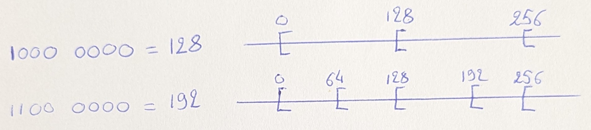

par exemple, pour 128, les adresses IP d'un sous-réseau sont :
* soit toutes entre 0 et 127 (sous-entendu : entre 1 et 126)
* soit toutes entre 128 et 255 (sous-entendu : entre 129 et 254)

--- 

pour le masque 1110 0000 = 224, il y a 3 bits pour différencier les adresses réseaux donc il y a 8 plages d'adresses possibles :

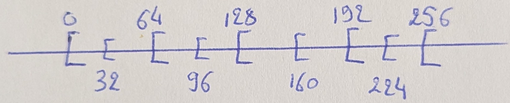

---  

pour le masque 1111 0000 = 240, les plages vont de 16 en 16 :

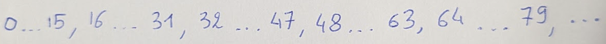

(ou en partant de la fin :)

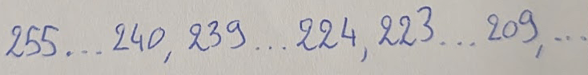

---

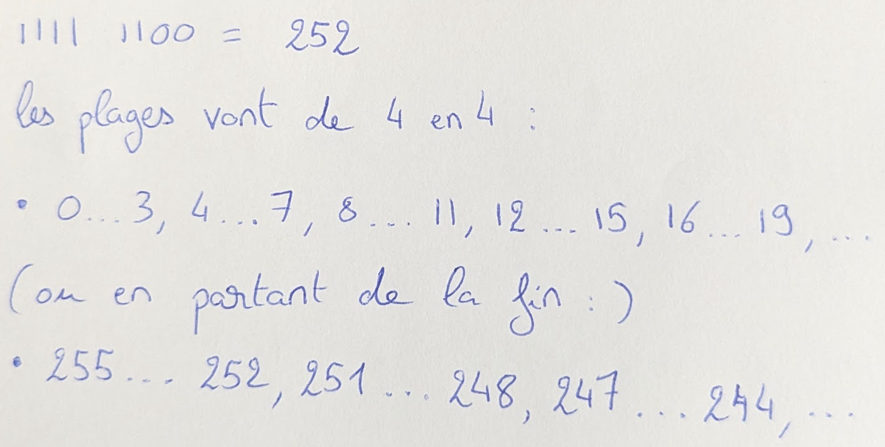

c'est le plus gros masque possible. il ne laisse la place que de coder 2 hôtes par sous-réseau.

[&uarr; retour au sommaire &uarr;](#sommaire)

## niveau 1

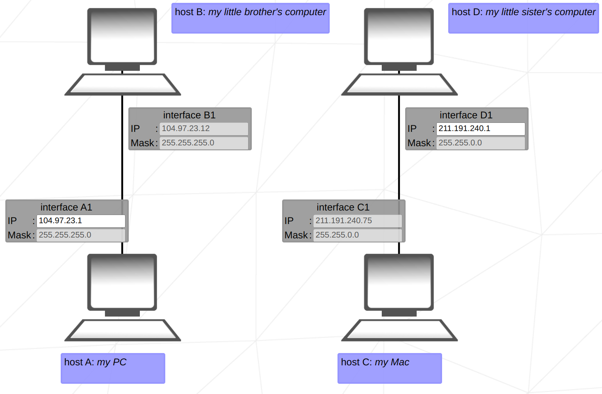

### premier réseau

le réseau est un unique sous-réseau.

le masque indique que le sous-réseau est codé sur les 3 premiers octets des adresses IP.

il suffit d'utiliser une adresse identique sur les 3 premiers octets.

### deuxième réseau

c'est la même chose sauf que le sous-réseau est codé sur les 2 premiers octets.

[&uarr; retour au sommaire &uarr;](#sommaire)

## niveau 2

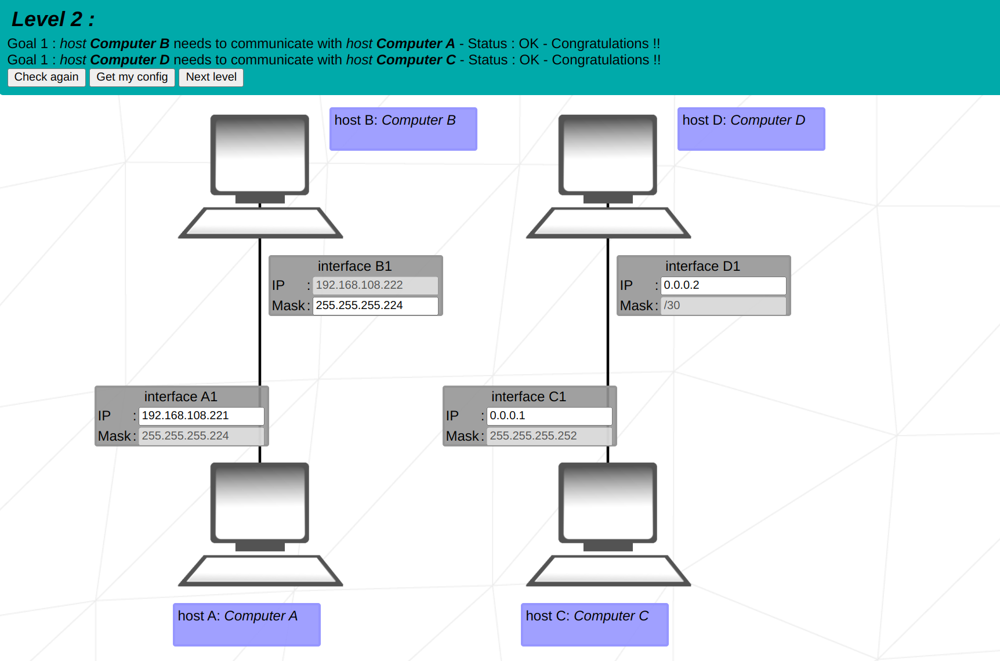

[&uarr; retour au sommaire &uarr;](#sommaire)

## niveau 3

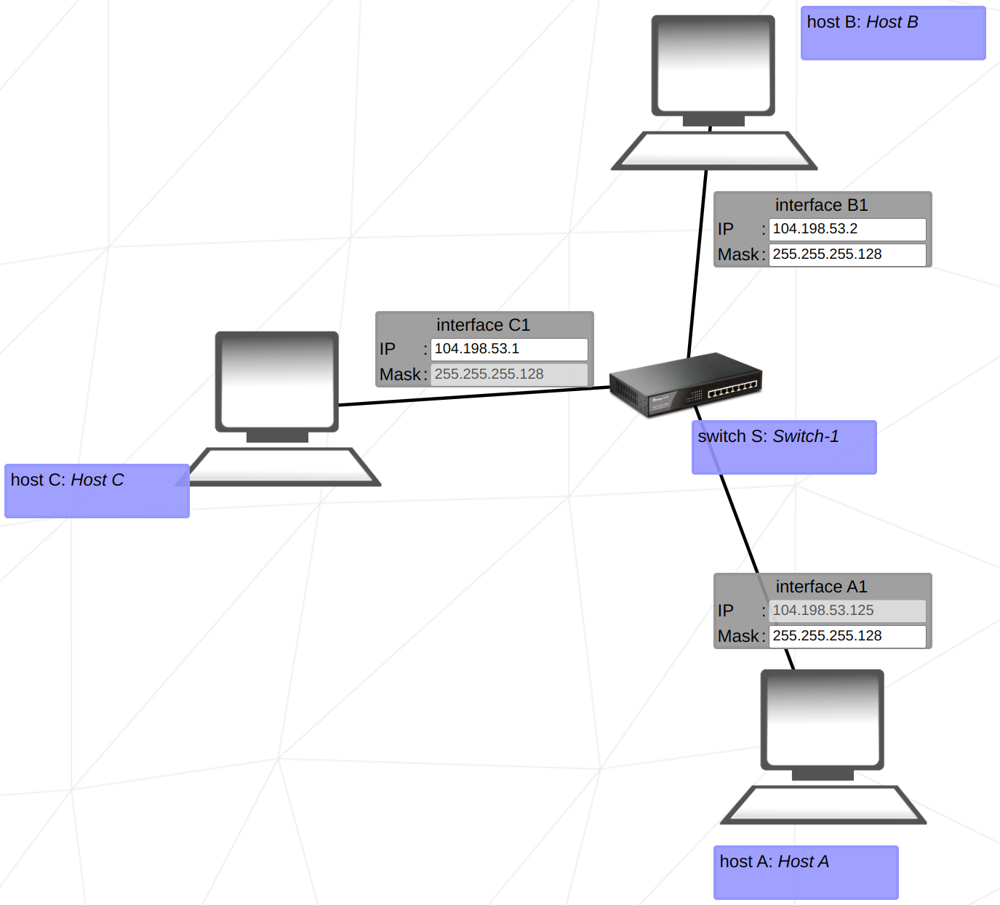

[&uarr; retour au sommaire &uarr;](#sommaire)

## niveau 4

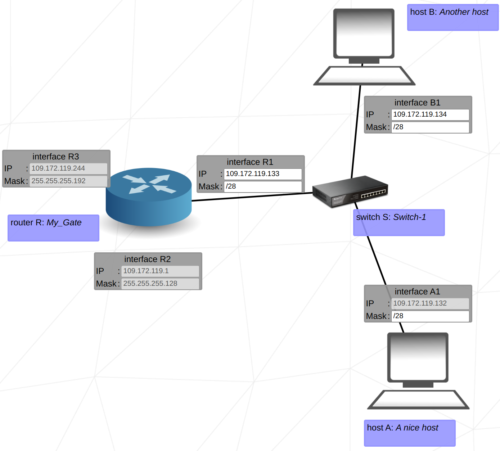

[&uarr; retour au sommaire &uarr;](#sommaire)

## niveau 5

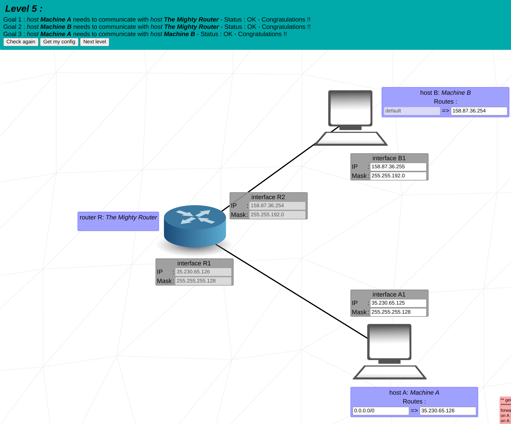

[&uarr; retour au sommaire &uarr;](#sommaire)

## niveau 6

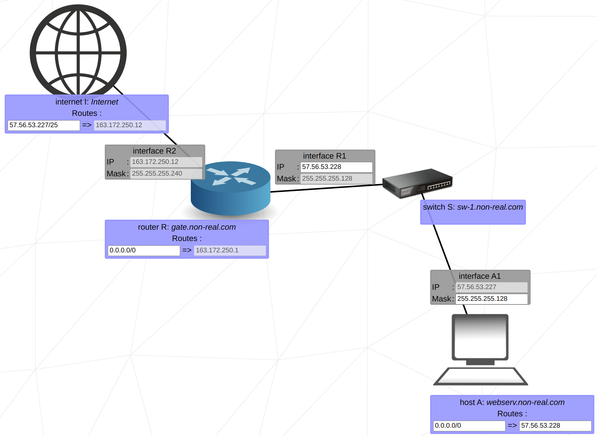

[&uarr; retour au sommaire &uarr;](#sommaire)

## niveau 7

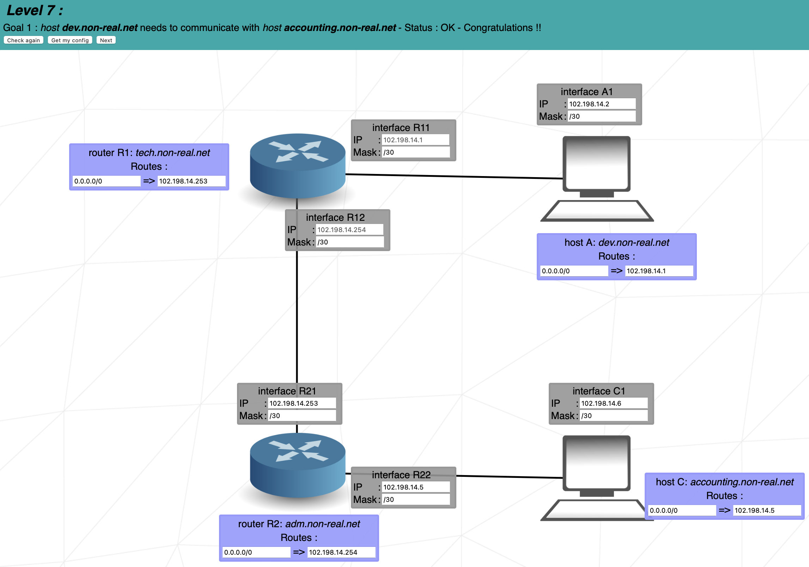

[&uarr; retour au sommaire &uarr;](#sommaire)

## niveau 8

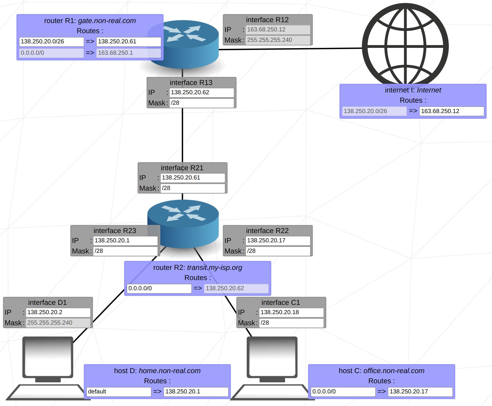

[&uarr; retour au sommaire &uarr;](#sommaire)

## niveau 9


[&uarr; retour au sommaire &uarr;](#sommaire)

## niveau 10 
<span style="text-align: right;"></span>

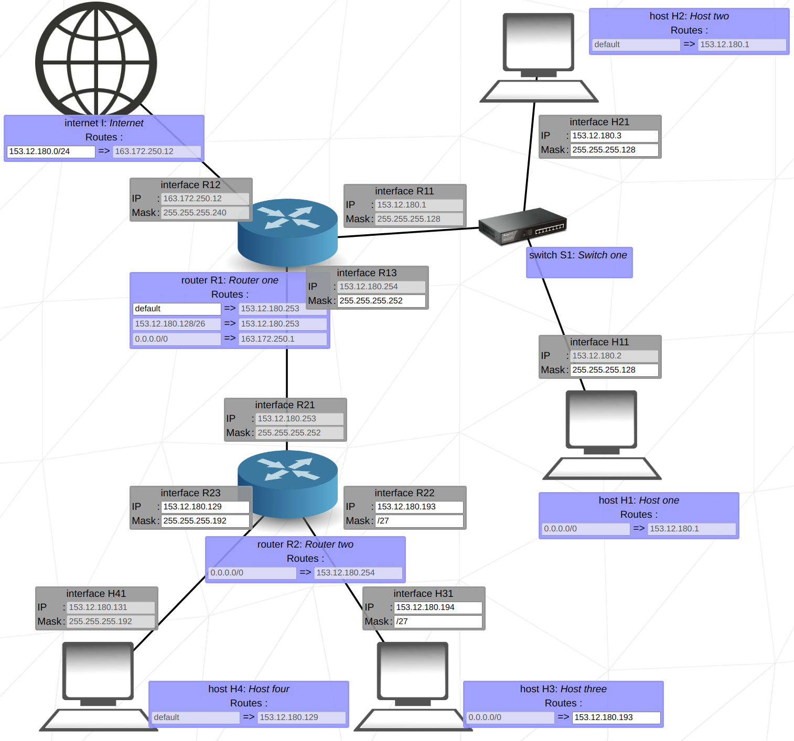

[&uarr; retour au sommaire &uarr;](#sommaire)
