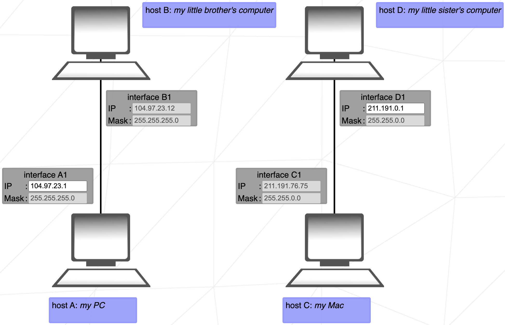
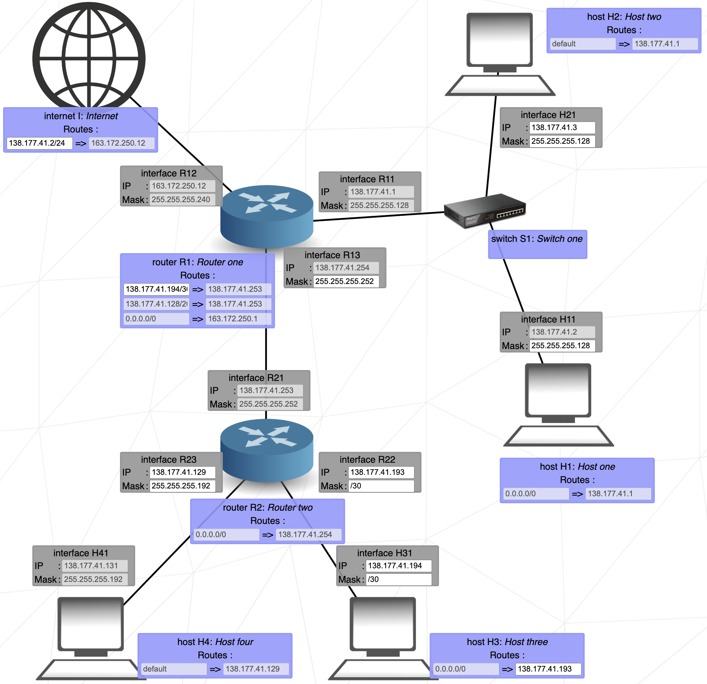

# petit guide de NetPractice 

## sommaire

<!-- no toc -->
  - [rappels sur le binaire](#rappels-sur-le-binaire)
  - [la base sur les réseaux](#la-base-sur-les-réseaux)
  - [division d'un octet par plages de valeurs selon le masque](#division-dun-octet-par-plages-de-valeurs-selon-le-masque)
  - [les équipements réseau](#les-équipements-réseau)
  - [niveau 1](#niveau-1)
  - [niveau 2](#niveau-2)
  - [niveau 3](#niveau-3)
  - [niveau 4](#niveau-4)
  - [niveau 5](#niveau-5)
  - [niveau 6](#niveau-6)
  - [niveau 7](#niveau-7)
  - [niveau 8](#niveau-8)
  - [niveau 9](#niveau-9)
  - [niveau 10](#niveau-10)

## rappels sur le binaire

tous les nombres décimaux (= écrits en base 10) peuvent s'écrire en binaire (= base 2).

un nombre binaire est composé de bits.  
1 bit = `0` ou `1`

sur n bits, on peut coder 2<sup>n</sup> valeurs différentes.

<details open>
<summary>quelques conversions (cliquer ici pour réduire) </summary>
<table style="font-family: monospace;">
  <thead>
    <tr>
      <th>décimal</th>
      <th>binaire</th>
    </tr>
  </thead>
  <tbody>
    <tr><td>0</td><td><code>00000000</code></td></tr>
    <tr><td>1</td><td><code>00000001</code></td></tr>
    <tr><td>2</td><td><code>00000010</code></td></tr>
    <tr><td>3</td><td><code>00000011</code></td></tr>
    <tr><td>4</td><td><code>00000100</code></td></tr>
    <tr><td>5</td><td><code>00000101</code></td></tr>
    <tr><td>6</td><td><code>00000110</code></td></tr>
    <tr><td>7</td><td><code>00000111</code></td></tr>
    <tr><td>8</td><td><code>00001000</code></td></tr>
    <tr><td>9</td><td><code>00001001</code></td></tr>
    <tr><td>10</td><td><code>00001010</code></td></tr>
    <tr><td>11</td><td><code>00001011</code></td></tr>
    <tr><td>12</td><td><code>00001100</code></td></tr>
    <tr><td>13</td><td><code>00001101</code></td></tr>
    <tr><td>14</td><td><code>00001110</code></td></tr>
    <tr><td>15</td><td><code>00001111</code></td></tr>
    <tr><td>16</td><td><code>00010000</code></td></tr>
    <tr><td>17</td><td><code>00010001</code></td></tr>
    <tr><td>30</td><td><code>00011110</code></td></tr>
    <tr><td>31</td><td><code>00011111</code></td></tr>
    <tr><td>32</td><td><code>00100000</code></td></tr>
    <tr><td>33</td><td><code>00100001</code></td></tr>
    <tr><td>34</td><td><code>00100010</code></td></tr>
    <tr><td>63</td><td><code>00111111</code></td></tr>
    <tr><td>64</td><td><code>01000000</code></td></tr>
    <tr><td>65</td><td><code>01000001</code></td></tr>
    <tr><td>126</td><td><code>01111110</code></td></tr>
    <tr><td>127</td><td><code>01111111</code></td></tr>
    <tr><td>128</td><td><code>10000000</code></td></tr>
    <tr><td>129</td><td><code>10000001</code></td></tr>
    <tr><td>130</td><td><code>10000010</code></td></tr>
    <tr><td>191</td><td><code>10111111</code></td></tr>
    <tr><td>192</td><td><code>11000000</code></td></tr>
    <tr><td>193</td><td><code>11000001</code></td></tr>
    <tr><td>223</td><td><code>11011111</code></td></tr>
    <tr><td>224</td><td><code>11100000</code></td></tr>
    <tr><td>225</td><td><code>11100001</code></td></tr>
    <tr><td>239</td><td><code>11101111</code></td></tr>
    <tr><td>240</td><td><code>11110000</code></td></tr>
    <tr><td>241</td><td><code>11110001</code></td></tr>
    <tr><td>247</td><td><code>11110111</code></td></tr>
    <tr><td>248</td><td><code>11111000</code></td></tr>
    <tr><td>249</td><td><code>11111001</code></td></tr>
    <tr><td>251</td><td><code>11111011</code></td></tr>
    <tr><td>252</td><td><code>11111100</code></td></tr>
    <tr><td>253</td><td><code>11111101</code></td></tr>
    <tr><td>254</td><td><code>11111110</code></td></tr>
    <tr><td>255</td><td><code>11111111</code></td></tr>
    <tr><td>256</td><td><code>100000000</code></td></tr>
  </tbody>
</table>
</details> 

1 octet = 8 bits

on peut coder 2<sup>8</sup> = 256 valeurs différentes sur un octet.  
ces valeurs vont de 
```
0 (décimal) = 0 (binaire)
```
à
```
255 (décimal) = 11111111 (binaire)
```

la table de vérité de l'opérateur binaire ET est la suivante :
```
0 ET 0 = 0
0 ET 1 = 0
1 ET 0 = 0
1 ET 1 = 1
```

on peut effectuer l'opération ET entre deux nombres en appliquant cette table de vérité bit à bit.  
par exemple :
```
9 ET 3 = 1
```
car 
``` 
9 (en décimal) = 1011 (en binaire)
3 (en décimal) = 0011 (en binaire)
1 (en décimal) = 0001 (en binaire)
```

[&uarr; retour au sommaire &uarr;](#sommaire)

## la base sur les réseaux

lorsque plusieurs appareils (ordinateurs, téléphones, imprimantes, ...) veulent communiquer entre eux, ils doivent utiliser des **protocoles de communication**.  
parmi ces protocoles, on retrouve **TCP/IP** (aussi appelé "la suite des protocoles Internet").

chaque appareil connecté est appelé un **hôte**.  

les données à envoyer sont divisées en **paquets**.  

**IP** (Internet Protocol) est le protocole d'adressage (&rarr; couche réseau dans le modèle OSI).  
il utilise les adresses des hôtes du réseau (les fameuses **adresses IP**) pour adresser correctement chaque paquet transmis.  
IP assure que les paquets arrivent à la bonne destination, mais il ne garantit ni leur ordre ni leur fiabilité.

**TCP** (Transmission Control Protocol) est le protocole de contrôle des transmissions (&rarr; couche transport dans le modèle OSI).  
il établit une connexion fiable entre chaque expéditeur et récepteur, vérifie que les paquets sont bien reçus (sinon, il les retransmet) et qu'ils arrivent dans le bon ordre (sinon, il les reclasse).

chaque hôte doit avoir une **adresse IP** unique ainsi qu'un **masque de sous-réseau**.  
dans les exercices, ça ressemble à ça : 


ici, les adresses IP et les masques sont codées sur 4 octets (c'est de l'IPv4).  
donner une adresse IP ou un masque, c'est donc donner les valeurs de ces 4 octets. par exemple :
adresse IP en décimal | adresse IP en binaire
-- | --
`128.255.0.5` | `10000000.11111111.00000000.00000101`

plusieurs hôtes forment localement un **sous-réseau**.  

dans un sous-réseau, tous les hôtes partagent la même **adresse de sous-réseau** et (pour rester simple) le même masque de sous-réseau.  
l'adresse du sous-réseau peut s'obtenir à partir de l'adresse IP d'un hôte en binaire, en lui appliquant son masque de sous-réseau (en binaire aussi). cela consiste à ne garder que les bits de l'adresse IP où le masque est à 1.  
exemple :
* adresse IP : `104.198.241.245` (en décimal)  
= `01101000.11000110.11110001.11110101` (en binaire)
* masque de sous-réseau : `255.255.255.128` (en décimal)  
= `11111111.11111111.11111111.10000000` (en binaire)

    &rarr; adresse du sous-réseau : `01101000.11000110.11110001.10000000` (en binaire)  
    = `104.198.241.128` (en décimal)

> c'est équivalent de dire que l'adresse du sous-réseau s'obtient en faisant l'opération binaire ET entre l'adresse IP et le masque de sous-réseau.

un masque de sous-réseau (en binaire) est toujours de la forme : "un certain nombre de 1" suivi de "un certain nombre de 0".  
on peut le donner sous forme binaire, décimale ou CIDR.  
la notation CIDR (Classless Inter-Domain Routing) consiste à écrire `/` + le nombre de 1 au début du masque. elle est pratique car elle permet de préciser un masque directement à la fin d'une adresse IP (voir plus bas).  
par exemple :
masque de sous-réseau en décimal | masque de sous-réseau en binaire | masque de sous-réseau en notation CIDR
-- | -- | --
`255.255.240.0` | `11111111.11111111.11110000.00000000` | `/20`

le masque de sous-réseau sépare donc une adresse IP entre les bits qui servent à coder le sous-réseau (à gauche) de ceux qui servent à coder l'hôte au sein du sous-réseau (à droite). il suffit de préciser le nombre de bits qui servent à coder le sous-réseau pour en déduire le nombre de bits qui servent à coder l'hôte au sein du sous-réseau.  
par exemple, avec un masque /26, on sait que les 26 premiers bits de l'adresse IP codent l'adresse du sous-réseau et, sachant que l'adresse IP d'un hôte est codée sur 4 octets (= 32 bits), on sait que les 6 derniers bits (= 32 - 26) codent l'adresse de l'hôte au sein du sous-réseau.  
par exemple :  

`01101111.11110010.11000001.00101101/25`  
(= `01101111.11110010.11000001.00101101` avec le masque `/25`)  
&rarr; `01101111.11110010.11000001.0` (les 25 premiers bits) + `0101101` (le reste)  
&rarr; adresse du sous-réseau : `01101111.11110010.11000001.00000000`  
&rarr; adresse de l'hôte au sein du sous-réseau : `00000000.00000000.00000000.00101101`

on observe que choisir un plus gros masque (`11111111.11111111.11111111.11111100` par exemple), c'est augmenter le nombre de sous-réseaux possibles dans le réseau au détriment du nombre d'hôtes par sous-réseau.  
en effet, en augmentant le masque, on augmente le nombre de bits permettant de coder le sous-réseau et on diminue le nombre de bits permettant de coder l'hôte en lui-même.

par ailleurs, comme tous les hôtes d'un sous-réseau doivent avoir la même adresse de sous-réseau, il faut que, dans un sous-réseau, toutes les adresses soient dans la même plage de valeurs.  
petit exemple sur 4 bits :
* si le masque est `0000`, tous les hôtes du réseau ne peuvent qu'être dans le même sous-réseau. dans ce sous-réseau, les adresses IP peuvent être entre 0 (= 0000 en binaire) et 15 (= 1111 en binaire).
* si le masque est `1000`, il peut y avoir 2 sous-réseaux dans le réseau. dans un de ces sous-réseaux, les adresses IP sont soit toutes entre 0 et 7 (elles sont de la forme 0xxx en binaire), soit toutes entre 8 et 15 (elles sont de la forme 1xxx en binaire).
* si le masque est `1100`, il peut y avoir 4 sous-réseaux. les plages d'adresses IP sont :
  * entre 0 et 3 (= de la forme 00xx en binaire)
  * entre 4 et 7 (= de la forme 01xx en binaire)
  * entre 8 et 11 (= de la forme 10xx en binaire)
  * entre 12 et 15 (= de la forme 11xx en binaire)

on observe qu'augmenter le masque d'un bit revient à chaque fois à :
* multiplier le nombre de plages d'adresses IP par 2 (c'est-à-dire multiplier le nombre maximal de sous-réseau dans le réseau par 2)
* diviser le nombre maximal d'hôtes par sous-réseau par 2.

attention, il faut faire la différence entre la plage des adresses possibles et les valeurs effectivement possibles. lorsque je dis que, dans un sous-réseau, l'adresse IP d'un hôte doit être dans la plage de valeurs entre `min` et `max`, je sous-entends qu'elle n'est ni à `min` ni à `max`. en effet, l'adresse `min` fait déjà référence à l'adresse du sous-réseau en lui-même et ne peut pas être prise telle quelle par l'un de ses hôtes. l'adresse `max` quant à elle est l'adresse de diffusion (= broadcast) de ce sous-réseau. elle sert à envoyer des paquets à tous les hôtes du sous-réseau à la fois et ne peut pas non plus être prise telle quelle par l'un des hôtes du sous-réseau.

[&uarr; retour au sommaire &uarr;](#sommaire)

## division d'un octet par plages de valeurs selon le masque


par exemple, pour 128, les adresses IP d'un sous-réseau sont :
* soit toutes entre 0 et 127 (sous-entendu : entre 1 et 126)
* soit toutes entre 128 et 255 (sous-entendu : entre 129 et 254)

--- 

<span id="m224"></span>pour le masque 1110 0000 = 224, il y a 3 bits pour coder les adresses réseaux et 5 bits pour coder les hôtes d'un sous-réseaux. donc il y a 8 (= 2<sup>3</sup>) plages d'adresses possibles qui vont de 32 en 32 (= 2<sup>5</sup>) :


---  

<span id="m240"></span>pour le masque 1111 0000 = 240, les plages vont de 16 en 16 :


(ou en partant de la fin :)


---


c'est le plus gros masque possible. il ne laisse la place que de coder 2 hôtes par sous-réseau.

[&uarr; retour au sommaire &uarr;](#sommaire)

## les équipements réseau

on a déjà vu les hôtes. voici les autres équipements qui composent les réseaux de NetPractice.

### le switch

un **switch** permet de connecter plusieurs hôtes dans un même sous-réseau.  
dans les exercices, il ressemble à ça :  


### le routeur

un **routeur** permet de connecter plusieurs sous-réseaux entre eux.  
dans les exercices, il ressemble à ça :  


il possède, lui-aussi, des **interfaces réseau** (une par sous-réseau connecté).  
pour faire simple, une interface réseau est un point de connexion dans le réseau, identifié par une adresse IP (qui doit être unique) et un masque de sous-réseau. 

lorsque plusieurs sous-réseaux sont connectés, la plage d'adresses IP de chaque sous-réseau ne doit pas chevaucher celle des autres !

### la table de routage

une **table de routage** est utilisée à un endroit précis du réseau (hôte, routeur, ...) pour définir la prochaine adresse à laquelle il faut envoyer un paquet lorsque l'adresse de destination de celui-ci est trop éloignée (on comprendra mieux en faisant les exercices).  

c'est une liste d'associations :  

* sous-réseau de destination &rarr; adresse IP suivante  
* sous-réseau de destination &rarr; adresse IP suivante  
* ...

dans les exercices, ça ressemble à ça :  


dans cet exemple, on voit notamment que lorsqu'un paquet veut rejoindre un hôte qui se trouve dans le sous-réseau `78.149.0.2/18` alors il est envoyé à `163.172.250.12`.  
`78.149.0.2/18` est équivalent à `78.149.0.0/18` et fait référence aux adresses IP comprises entre `78.149.0.0` et `78.149.63.255` (cf. <a href="#m128">plages pour 192</a>). 

lorsque l'adresse de destination de la table est à `default` (ou `0.0.0.0/0`) alors les paquets sont toujours (?) envoyés à l'adresse IP correspondante.

### Internet

le fameux réseau mondial de l'Internet est représenté ainsi :


il est forcément associé à une table de routage.  

on peut voir Internet comme un hôte qui n'a pas d'adresse IP en particulier.

lorsqu'un sous-réseau est connecté à Internet, les adresses IP suivantes ne peuvent pas être utilisées. en effet, elles sont réservées aux réseaux privés (ou réseaux locaux) déconnectés d'Internet.
* 192.168.x.x (en /16)
* de 172.16.x.x à 172.31.x.x (en /12)
* 10.x.x.x (en /8)

[&uarr; retour au sommaire &uarr;](#sommaire)

## niveau 1



### premier réseau

le réseau est un unique sous-réseau.

le masque indique que le sous-réseau est codé sur les 3 premiers octets des adresses IP. il suffit donc d'utiliser une adresse identique sur les 3 premiers octets.

### deuxième réseau

c'est la même chose sauf que le sous-réseau est codé sur les 2 premiers octets.

aucun problème à utiliser `211.191.0.75` ou `211.191.76.1` par exemple.

[&uarr; retour au sommaire &uarr;](#sommaire)

## niveau 2


### premier réseau

c'est encore un unique sous-réseau.

```
224 (en base 10) = 1110 0000 (en binaire)
```

donc on sait que le sous-réseau est codé sur les 27 premiers bits des adresses IP.  

les 3 premiers octets des adresses IP doivent rester identiques et, pour le dernier octet, on sait qu'il est divisé en 8 plages de valeurs qui vont de 32 en 32 (cf. <a href="#m224">plages avec 224</a>).  

comme on doit être dans la même plage que 222, qui est < 224, on peut choisir 221 par exemple. 223 est forcément une adresse de broadcast car 224 est le début d'une nouvelle plage.

### deuxième réseau

voir les <a href="#m252">plages avec 252</a>.

les adresses 127.x.x.x sont réservées pour le **loopback**, aussi appelé **localhost**, qui consiste à renvoyer des paquets vers son expéditeur sans passer par le réseau.

[&uarr; retour au sommaire &uarr;](#sommaire)

## niveau 3


on a un sous-réseau composé de 3 hôtes reliés par un switch.

le masque imposé indique que le sous-réseau est codé sur les 25 premiers bits. 

les 3 premiers octets doivent donc être identiques et, comme le dernier octet de l'adresse IP imposée est à 125, le dernier octet doit être entre 0 et 127 (cf. <a href="#m128">plages avec 128</a>).

[&uarr; retour au sommaire &uarr;](#sommaire)

## niveau 4


on a un sous-réseau de 2 hôtes connecté à un routeur.

le routeur a 3 interfaces, il relie donc 3 sous-réseaux, et on doit faire attention à ce que les plages de valeurs de ces 3 sous-réseaux ne se chevauchent pas.

sur l'interface R3, on est en /26 (cf. <a href="#m128">plages avec 192</a>) et le dernier octet est à 244, ce qui est > 192. donc toute la plage d'adresses de `117.122.115.192` à `117.122.115.255` est réservée par ce sous-réseau.

sur l'interface R2, on est en /25 (cf. <a href="#m128">plages avec 128</a>) et le dernier octet est à 1, ce qui est < 128. donc toute la plage d'adresses de `117.122.115.0` à `117.122.115.127` est réservée par ce sous-réseau.

les adresses libres sur le dernier octet vont de `117.122.115.128` à `117.122.115.191`. cela correspond à un intervale de 64 valeurs, donc au masque /26 (cf. <a href="#m128">plages avec 192</a>).

on aurait très bien pu augmenter le masque pour restreindre le nombre d'hôtes que l'on peut coder au sein du sous-réseau de droite.

un masque /30 ne suffirait pas à coder 3 interfaces différentes au sein du sous-réseau. en revanche, on peut choisir un /28, par exemple, ce qui permet de coder 14 (= 16 - 2) hôtes par sous-réseau (cf. <a href="#m240">plages avec 240</a>).

en /28, les plages vont de 16 en 16, donc on aurait pu utiliser toutes les adresses qui sont dans la même plage que `117.122.115.132`, c'est-à-dire, dans l'intervalle entre `117.122.115.128` et `117.122.115.143` (car 128 + 16 = 144).

on aurait aussi pu utiliser un /29 ou un /27, mais pas un /25 car il aurait réservé la plage entre `117.122.115.128` et `117.122.115.255` et, comme nous l'avons dit, la plage entre `117.122.115.192` et `117.122.115.255` est déjà réservée par l'interface R3.

[&uarr; retour au sommaire &uarr;](#sommaire)

## niveau 5


aucun risque de chevauchement puisque les adresses IP n'ont rien à voir l'une avec l'autre.

en revanche, lorsqu'un paquet doit aller d'un hôte à l'autre, il a besoin de passer par la table de routage de l'hôte expéditeur.

en effet, en partant de A, si l'adresse de destination est l'adresse IP de B, un paquet ne peut pas savoir de lui-même qu'il doit se rendre au routeur. il faut le lui préciser dans la table de routage de A.  
une fois au routeur, il va trouver son chemin vers B car une interface du sous-réseau de B est connectée au routeur.

en destination de la table de la routage, le plus simple est d'utiliser `default`, puisqu'il n'y a que 2 hôtes, mais on peut aussi indiquer plus précisément le sous-réseau de B, avec par exemple :
* `158.87.36.255/18` (= les adresses entre `158.87.0.0` et `158.87.63.255`) (cf. <a href="#m128">plages pour 192</a>)
* `158.87.63.255/18` (c'est toujours la même plage d'adresses) 
* `158.87.0.0/0` (c'est l'adresse du sous-réseau de B, sans masque)

[&uarr; retour au sommaire &uarr;](#sommaire)

## niveau 6


il y a 2 sous-réseaux.

dans le sous-réseau de A, le dernier octet doit être > 128 (cf. <a href="#m128">plages pour 128</a>).

la table de routage du routeur s'occupe d'envoyer les paquets de A vers Internet.

pour qu'un paquet puisse passer d'Internet au sous-réseau de A, il faut donner l'adresse du sous-réseau de A à la table de routage d'Internet où, plus simplement, la plages de adresses du sous-réseau de A comme je le fais ici.

[&uarr; retour au sommaire &uarr;](#sommaire)

## niveau 7


il y a 3 sous-réseaux.

le nombre d'interfaces par sous-réseau n'étant jamais > 2, on peut utiliser un masque /30.  
cela permet d'utiliser `105.198.14` au début de chaque adresse IP et de définir 3 plages distinctes sur le dernier octet :
* de 0 et 3 pour le sous-réseau de A
* de 252 à 255 pour le sous-réseau du milieu
* de 4 à 7 (par exemple) pour le sous-réseau de C

on peut aussi utiliser un masque /29, /28, /27 ou /26, mais pas /25 car cela ne ferait que 2 plages possibles dans le dernier octet (cf. <a href="#m128">plages pour 128</a>).

autre exemple, en /26 on peut utiliser :
* de `105.198.14.0` à `105.198.14.63` pour le sous-réseau de A
*  de `105.198.14.192` à `105.198.14.255` pour le sous-réseau du milieu
*  de `105.198.14.64` à `105.198.14.127` (ou de `105.198.14.128` à `105.198.14.191`) pour le sous-réseau de C

là encore, on peut spécifier les destinations des tables de routage en utilisant les adresses réseau de A et C mais le plus simple est d'utiliser `default`.

[&uarr; retour au sommaire &uarr;](#sommaire)

## niveau 8


il y a 4 sous-réseaux.

la table de routage d'Internet sert à désigner l'interface du routeur R1 lorsqu'Internet veut envoyer des paquets à C ou D. cela nous indique que C et D doivent avoir pour adresse de sous-réseau `138.250.20.0/26`, et donc, qu'ils se trouvent dans la plage entre `138.250.20.0` et `138.250.20.63` (cf. <a href="#m128">plages pour 192</a>). 

la table de routage de R1 sert à diriger les paquets, soit vers Internet (par défaut), soit vers C et D lorsqu'ils cherchent le sous-réseau `138.250.20.0/26`.

la table de routage du routeur R2 sert forcément à diriger les paquets vers Internet (sinon, elle ne servirait à rien car C et D sont directement accessibles à partir d'ici). elle nous indique que le sous-réseau du milieu (composé de R13 et R21) utilise une plage contenant `138.250.20.62`.

les 3 sous-réseaux du bas utilisent donc une adresse IP identique sur les 3 premiers octets.

dans le sous-réseau de D on peut utiliser, par exemple, les 16 premières valeurs du dernier octet (de 0 à 15).

pour le reste des sous-réseaux, on est libre d'utiliser les masques qu'on veut. on peut notamment utiliser /30 car il n'y a que 2 interfaces à chaque fois.  

remarque pour R13 : `138.250.20.63` est forcément une adresse de broadcast car 64 est le début d'une nouvelle plage de valeurs.

les adresses IP dans le sous-réseau de C doivent être entre `138.250.20.0` et `138.250.20.63` moins l'intervalle des 16 valeurs du sous-réseau de D moins l'intervalle de x valeurs du sous-réseau qui contient `138.250.20.62`.

personnellement, j'utilise des plages de 16 en 16 partout (cf. <a href="#m240">plages de 240</a>).

[&uarr; retour au sommaire &uarr;](#sommaire)

## niveau 9


il y a 5 sous-réseaux.

je vous conseille de suivre ces étapes :
* connecter A et B entre eux
* connecter C et D entre eux
* connecter A et B à Internet
* connecter C et D à Internet

le plus simple est de distinguer un sous-réseau pour A et B et un autre pour C et D, mais on peut aussi tout faire dans la plage imposée par D en /8 par exemple (voir ci-dessous).

j'utilise `0.0.0.0/25` comme adresse de sous-réseau de A et B. je reporte donc ce sous-réseau dans la destination des paquets d'Internet vers A.

le sous-réseau de D est imposé par la table de routage de D.

j'utilise le même masque que pour D dans le sous-réseau de C, en utilisant une autre plage sur le 3e octet (cf. <a href="#128">plages pour 192</a>).

pour que les paquets d'Internet à destination de C trouvent leur chemin, je reporte le sous-réseau de C dans la table de routage d'Internet.

enfin, il faut comprendre que la table de routage de R1 sert à envoyer les paquets vers C et D (et Internet) et que la table de routage de R2 sert à les renvoyer dans l'autre sens.

une autre solution un peu moins propre :


on peut aussi utiliser `93.191.192.113/16` comme destination du routeur R1.

[&uarr; retour au sommaire &uarr;](#sommaire)

## niveau 10 
<span style="text-align: right;"></span>



encore une fois, il y a 5 sous-réseaux.

je vous conseille de suivre ces étapes :
* connecter H1 et H2 entre eux
* connecter H3 et H4 entre eux
* compléter les tables de routage

toutes les adresses sont identiques sur les 3 premiers octets. il faut donc juste faire attention au chevauchement des plages sur le dernier octet. 

dans le premier sous-réseau (pour H1 et H2), on nous impose de rester entre `138.177.41.0` et `138.177.41.127` (cf. <a href="#m128">plages pour 128</a>).

dans le sous-réseau du milieu (pour R13 et R21), on nous impose de rester entre `138.177.41.252` et `138.177.41.255` (cf. <a href="#m252">plages pour 252</a>).

dans le sous-réseau de H4, on nous impose la plage entre `138.177.41.128` et `138.177.41.191` (cf. <a href="#m128">plages pour 192</a>).

à ce stade, il ne reste donc disponibles que les adresses entre `138.177.41.192` et `138.177.41.251` pour le sous-réseau de H3. il faut donc utiliser un masque qui permette de coder au plus 57 valeurs (= 251 - 192 - 2) par plage. le plus simple est d'utiliser /30 mais on peut aussi utiliser :
* le /29 qui va de 8 en 8
* le /28 qui va de 16 en 16
* le /27 qui va de 32 en 32

si on utilisait /26 avec l'adresse `138.177.41.193`, on réserverait la plage de `138.177.41.192` à `138.177.41.255` et on chevaucherait le sous-réseau du milieu.

en sous-réseau de destination d'Internet, on peut utiliser les 3 premiers octets des adresses des hôtes.

en destination de R1, on peut utiliser le sous-réseau de H3 (c'est le seul qui n'est pas connecté) ou simplement `default`.

[&uarr; retour au sommaire &uarr;](#sommaire)
